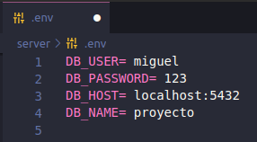

# Sistema de Registro de Alta, Baja y Cambio de Tareas

Este sistema es una aplicación web que permite realizar un seguimiento de tareas en una institución, brindando a los equipos la capacidad de administrar tareas de manera efectiva.

## Tecnologías Utilizadas

- **Frontend:**

  - React: Biblioteca de JavaScript para construir interfaces de usuario.
  - Redux: Biblioteca de gestión de estado para mantener un estado global en la aplicación.
  - Tailwind CSS: Framework de estilos CSS altamente personalizable.
  - Axios: Cliente HTTP para realizar solicitudes a la API del backend.
  - React Icons: Conjunto de iconos para mejorar la interfaz de usuario.
  - React Router DOM: Enrutador para la navegación dentro de la aplicación.
  - Redux Thunk: Middleware para realizar acciones asíncronas con Redux.
  - UUID: Generador de identificadores únicos para tareas u otros objetos.
  - Web Vitals: Herramienta para medir el rendimiento.

- **Backend:**

  - Express: Framework de aplicaciones web para Node.js.
  - Axios: Cliente HTTP para realizar solicitudes a otros servicios.
  - Cors: Middleware para habilitar el acceso a recursos desde diferentes dominios.
  - Dotenv: Cargador de variables de entorno desde un archivo.
  - Jest: Framework de pruebas para el desarrollo de tests.
  - Morgan: Middleware para el registro de solicitudes HTTP.
  - PostgreSQL: Sistema de gestión de base de datos relacional.
  - Sequelize: ORM (Object-Relational Mapping) para interactuar con la base de datos.
  - Supertest: Biblioteca para realizar pruebas de integración en el servidor.

- **Herramientas de Desarrollo:**
  - Node.js: Plataforma de tiempo de ejecución de JavaScript utilizada (v18.14.2).
  - NPM: Gestor de paquetes para JavaScript.
  - Yarn: Otra opción para gestionar dependencias de JavaScript (opcional).

## Estructura de Carpetas

El proyecto está organizado en una sola carpeta con dos subcarpetas:

- `client_form`: Contiene el código del frontend de la aplicación, desarrollado con React, Redux y Tailwind CSS.

- `server`: Contiene el código del backend de la aplicación, construido con Express, Sequelize y PostgreSQL.

## Configuración y Uso

Para poner en marcha la aplicación:

1. Asegúrate de que tienes Node.js instalado en tu sistema. La versión utilizada en este proyecto es Node.js v18.14.2.

2. Configuración de Variables de Entorno (.env)
   Antes de ejecutar la aplicación, asegúrate de configurar las variables de entorno necesarias mediante un archivo `.env`. Estas variables son esenciales para la configuración de la aplicación y deben mantenerse privadas. Puedes crear un archivo `.env` en la carpeta raíz del proyecto y definir las variables requeridas, como las credenciales de la base de datos o cualquier otra información confidencial.

   Asegúrate de incluir el archivo `.env` en el archivo `.gitignore` para evitar que se suba al control de versiones y mantener segura la información sensible.

   -Configuración de la base de datos PostgreSQL

   - DB_HOST=localhost
   - DB_NAME=nombre_de_la_base_de_datos
   - DB_USER=usuario_de_la_base_de_datos
   - DB_PASSWORD=contraseña_de_la_base_de_datos

   EJEMPLO:

    

3. Navega a la carpeta raíz del proyecto.

4. Navega a la carpeta `client_form` para configurar y ejecutar el frontend.

   ./cd client_form

   - npm install
   - npm start

5. Luego, dirígete a la carpeta `server` para configurar y ejecutar el backend

   ./cd server

   - npm install
   - npm start